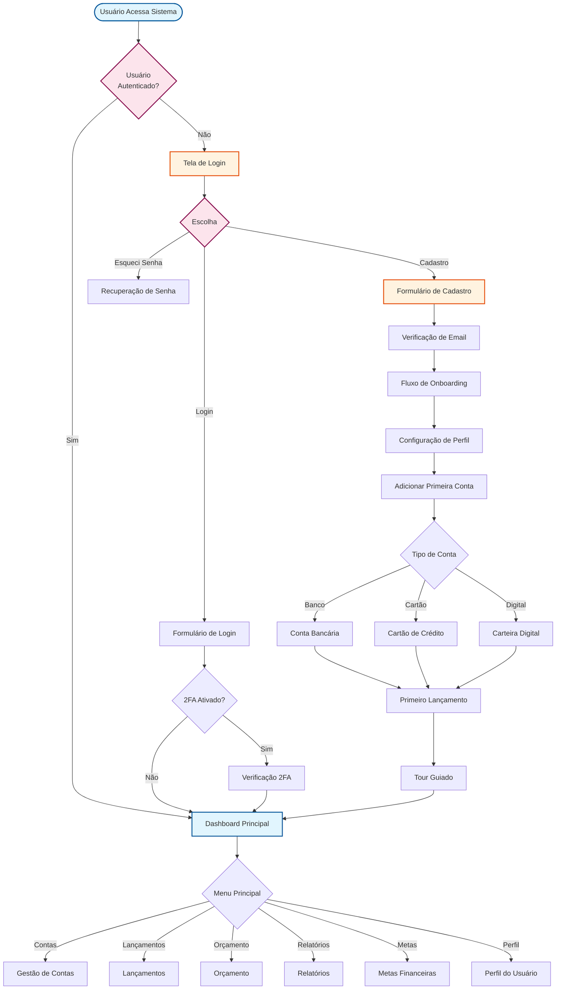

<div align="center">
  <h1 align="center">Sistema de Gestão Financeira Pessoal</h1>
  <p align="center">
    Transforme sua relação com o dinheiro. Controle suas finanças de forma intuitiva, visual e eficaz.
    <br />
    <a href="#sobre-o-projeto"><strong>Explore a documentação »</strong></a>
    <br />
    <br />
    <a href="#">Ver Demo</a>
    ·
    <a href="https://github.com/usuario/repositorio/issues">Reportar Bug</a>
    ·
    <a href="https://github.com/usuario/repositorio/issues">Solicitar Feature</a>
  </p>
</div>

<div align="center">


</div>

---

## Tabela de Conteúdos

- [Sobre o Projeto](#sobre-o-projeto)
- [Funcionalidades](#funcionalidades)
- [Roadmap](#roadmap)
- [Stack Tecnológica](#stack-tecnológica)
- [Fluxo do Usuário](#fluxo-do-usuário)
- [Esquema do Banco de Dados](#esquema-do-banco-de-dados)
- [Começando](#começando)
- [Licença](#licença)
- [Contato](#contato)

---

## Sobre o Projeto

O **Sistema Web de Gestão Financeira Pessoal** é uma plataforma digital projetada para capacitar os usuários a gerenciar suas finanças de forma centralizada, intuitiva e eficiente. O sistema oferece um conjunto robusto de ferramentas para controle de receitas e despesas, planejamento orçamentário, análise de padrões de gastos e acompanhamento de metas financeiras.

**Nossa Proposta de Valor:**
> "Transforme sua relação com o dinheiro através de uma plataforma que torna o controle financeiro simples, visual e eficaz, ajudando você a tomar decisões mais inteligentes e alcançar seus objetivos financeiros."

### Objetivos

- **Simplificar** o controle financeiro com uma interface amigável.
- **Fornecer insights** valiosos sobre padrões de gastos.
- **Auxiliar** no alcance de metas financeiras através de planejamento.
- **Promover** a educação financeira com dicas e recursos.

---

## Funcionalidades

### Essenciais (MVP)

- **🔐 Autenticação e Perfil:** Cadastro seguro, login e gerenciamento de perfil.
- **📊 Dashboard Principal:** Visão geral do saldo, resumo mensal e gráficos financeiros.
- **🏦 Gestão de Contas:** Cadastro de contas bancárias, cartões e carteiras digitais.
- **💸 Lançamentos Financeiros:** Registro detalhado de receitas e despesas, com anexos e recorrências.
- **🏷️ Categorias:** Sistema de categorias pré-definidas e personalizáveis.
- **💰 Orçamento:** Definição de orçamentos mensais por categoria com alertas de gastos.
- **📈 Relatórios Básicos:** Extratos detalhados e gráficos de despesas para exportação.

---

## Roadmap

### Fase 2 (Intermediário)

- **🎯 Metas Financeiras:** Criação e acompanhamento de metas de economia.
- **📅 Planejamento Financeiro:** Projeção de fluxo de caixa e simuladores.
- **🧠 Análise Avançada:** Insights automáticos e comparativos de gastos.
- **🔗 Integração Bancária:** Sincronização via Open Banking.

### Fase 3 (Avançado)

- **💹 Investimentos:** Acompanhamento de carteira e rentabilidade.
- **👨‍👩‍👧‍👦 Compartilhamento Familiar:** Contas e orçamentos compartilhados.
- **🎓 Educação Financeira:** Conteúdo personalizado e gamificação.
- **🤖 Assistente Virtual:** Chatbot com análises preditivas e recomendações.

---

## Stack Tecnológica

Este projeto foi construído utilizando as mais modernas tecnologias para desenvolvimento web:

- **Frontend:**
  - [Next.js 15+](https://nextjs.org/) (App Router)
  - [React 19](https://react.dev/)
  - [Tailwind CSS 4](https://tailwindcss.com/)
  - [Shadcn/UI](https://ui.shadcn.com/)
  - [Framer Motion](https://www.framer.com/motion/)
- **Backend:**
  - [Node.js](https://nodejs.org/)
  - [TypeScript](https://www.typescriptlang.org/)
- **Banco de Dados:**
  - [Prisma ORM](https://www.prisma.io/)
  - [SQLite](https://www.sqlite.org/index.html)
- **Validação:**
  - [Zod](https://zod.dev/)
  - [React Hook Form](https://react-hook-form.com/)

---

## Fluxo do Usuário

O fluxograma abaixo detalha a jornada do usuário dentro do sistema, desde a autenticação até a gestão de suas finanças.



---

## Esquema do Banco de Dados

O esquema do banco de dados foi modelado com Prisma e define a estrutura central para armazenamento de todas as informações do usuário de forma segura e relacional.

```prisma
// This is your Prisma schema file,
// learn more about it in the docs: https://pris.ly/d/prisma-schema
generator client {
provider = "prisma-client-js"
}
datasource db {
provider = "sqlite"
url = env("DATABASE_URL")
}
// ==========================================
// USUÁRIOS E AUTENTICAÇÃO
// ==========================================
model User {
id String @id @default(cuid())
email String @unique
password String
name String
avatarUrl String?
phone String?

// Configurações de segurança
twoFactorEnabled Boolean @default(false)
twoFactorSecret String?
emailVerified Boolean @default(false)
emailVerifiedAt DateTime?

// Configurações de preferências
language String @default("pt-BR")
currency String @default("BRL")
theme String @default("light") // light, dark, auto
timezone String @default("America/Sao_Paulo")

// Relacionamentos
accounts Account[]
categories Category[]
transactions Transaction[]
budgets Budget[]
goals Goal[]
}

// ... (demais modelos)
```

---

## Começando

Para executar uma cópia local do projeto, siga estes passos simples.

### Pré-requisitos

Certifique-se de ter o Node.js e o npm instalados em sua máquina.

- **npm**
  ```sh
  npm install npm@latest -g
  ```

### Instalação

1. Clone o repositório
   ```sh
   git clone https://github.com/usuario/repositorio.git
   ```
2. Navegue até o diretório do projeto
   ```sh
   cd gestao_financeira_template
   ```
3. Instale os pacotes NPM
   ```sh
   npm install
   ```
4. Configure suas variáveis de ambiente
   - Crie um arquivo `.env` na raiz do projeto.
   - Adicione a seguinte variável, apontando para o arquivo do banco de dados:
     ```
     DATABASE_URL="file:./db/custom.db"
     ```
5. Execute as migrações do banco de dados
   ```sh
   npm run db:migrate
   ```
6. Inicie o servidor de desenvolvimento
   ```sh
   npm run dev
   ```

O servidor estará disponível em `http://localhost:3000`.

---